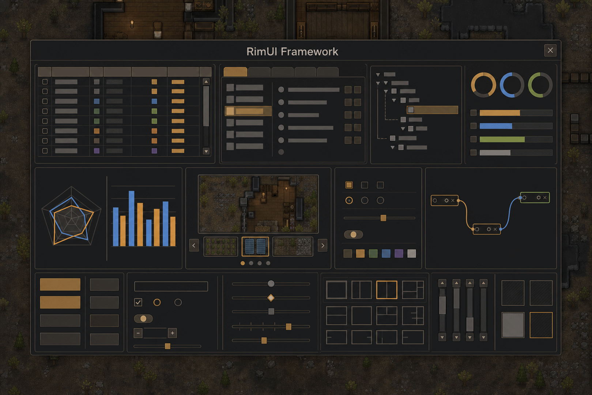

**RimUI Framework** — core `0.8.31` · mod `0.3.1` · RimWorld `1.6`

---

[Table of contents](../index_en.md) - Data | Previous: [OrderList&lt;T&gt;](02_orderlist_en.md) | Next: [Tree](04_tree_en.md) | [Русский](03_picklist_ru.md)

---

# PickList&lt;T&gt;

Moves items between two lists using center buttons or double-click. Ctrl and Shift allow moving several selected items at once.

`RimUI.Components.PickList<T> : UiElement` (generic)

## Example

```csharp
var pick = new PickList<string>(null) { Style = { Height = 200f } };
pick.Source.Items.AddRange(new[] { "Rifle", "Pistol", "Club" });
pick.Target.Items.Add("Knife");
```

## Parameters

| Parameter | Type | Default | Description |
|---|---|---|---|
| `Key` | `string` | `null` | State key in the ID store (see "Keys and state" on the Architecture page). Needed when the element is recreated between frames, or when its state must survive such recreation. |
| `Source` | `ListBox<T>` (readonly) | new `ListBox<T>()` | Available items. |
| `Target` | `ListBox<T>` (readonly) | new `ListBox<T>()` | Chosen items. |
| `OnChange` | `Action<List<T>, List<T>>` | `null` | Receives `(Source.Items, Target.Items)` after a move. |
| `SourceTitle` | `string` | `"Available"` | Left-column title. |
| `TargetTitle` | `string` | `"Selected"` | Right-column title. |
| `Disabled` | `bool` | `false` | Disables lists and buttons. |
| `ButtonsWidth` | `float` | `26` | Button-column width. |
| `TitleHeight` | `float` | `20` | Column-title height. |
| `Rows` | `int` | `6` | Fixed list height in rows; `Style.Height` takes priority. |

## Styles

Internal `ListBox` slots (`list/*`), `list/title`, and `list/button*`.

## Methods

| Method | Returns | Description |
|---|---|---|
| `PickList(Action<List<T>, List<T>> onChange = null)` (constructor) | - | Creates a pick list with a change callback. |
| `SetStyle(string path, string value)` | `void` | Applies the path to the root style. Unknown paths and values are ignored. |

Double-clicking a row moves it through internal `OnActivate` handlers. Buttons move selected or all items in either direction. **There is no mouse drag between lists.** Selection belongs to `Source` and `Target`; use their `GetSelected` and `SetSelected` methods.

## Events

| Event | Type | Parameters | When it fires |
|---|---|---|---|
| `OnChange` | `Action<List<T>, List<T>>` | source and target lists | After each transfer. |
| `Events.HoverEnter` / `Events.HoverLeave` | `UiEventHandler` | `data.MousePosition` | Pointer enters or leaves the bounds, once per transition. |
| `Events.Hover` | `UiEventHandler` | `data.MousePosition` | Every frame while hovered; keep the handler lightweight. |
| `Events.Click` / `Events.RightClick` | `UiEventHandler` | `data.MousePosition` | Left or right click within the bounds. |
| `Events.Scroll` | `UiEventHandler` | `data.ScrollDelta` | Mouse wheel over the element. |
| `Events.DisabledChanged` | `UiEventHandler` | `data.Disabled` | Effective enabled state changes. |

`PickList` itself does not raise `SelectionChanged`. Subscribe to the internal `Source` and `Target` events.

## Feature support

| Feature | Supported | Notes |
|---|---|---|
| Style | Yes | Internal lists, `list/title`, and `list/button*`. |
| Sprite frame | Yes | Same mechanism as `OrderList`. |
| Animation | Yes | Shared `Style.Animation`. |
| Disabled | Yes | Forwarded to both lists and buttons. |
| Hover fade | No | Immediate `HoverOn`. |


---

[Table of contents](../index_en.md) - Data | Previous: [OrderList&lt;T&gt;](02_orderlist_en.md) | Next: [Tree](04_tree_en.md) | [Русский](03_picklist_ru.md)
## Support the author
If you enjoy RimUI Framework, you can support its development here:

[DonationAlerts](https://www.donationalerts.com/r/klimprog)
[Boosty](https://boosty.to/klimprog/donate)

**USDT (TRC20):** `TA4zq9F4TTrSQXjEESMBk8juQMGNLXX4B5`

Thank you! ❤️
